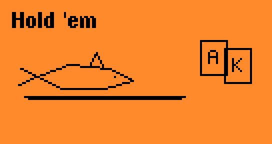
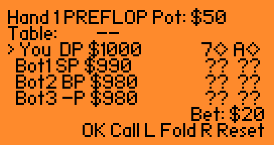
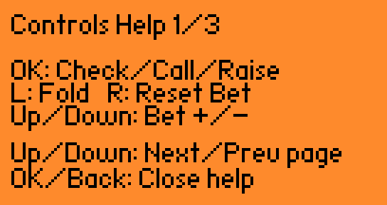
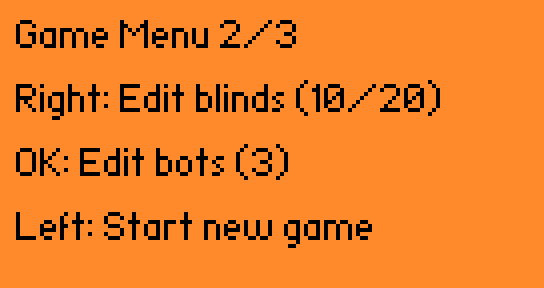
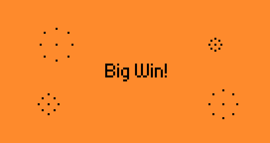
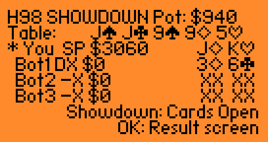
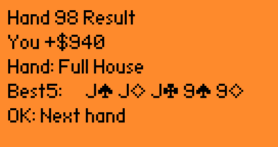
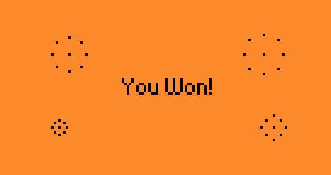

# Hold 'em for Flipper Zero

Native single-player Texas Hold'em built specifically for Flipper Zero.

Play a full table of compact, readable Hold 'em against up to three bots with real betting rounds, side-pot-aware showdowns, trustworthy save/load, and a UI tuned for the actual device screen. The current release is focused on feeling polished, fair, and immediately fun to play.

## Screenshots

The current release on-device flow at a glance:

<table>
  <tr>
    <td align="center" width="50%"><strong>Startup</strong></td>
    <td align="center" width="50%"><strong>Main Table</strong></td>
  </tr>
  <tr>
    <td align="center" width="50%"></td>
    <td align="center" width="50%"></td>
  </tr>
  <tr>
    <td align="center" width="50%"><strong>Controls</strong></td>
    <td align="center" width="50%"><strong>Game Settings</strong></td>
  </tr>
  <tr>
    <td align="center" width="50%"></td>
    <td align="center" width="50%"></td>
  </tr>
  <tr>
    <td align="center" width="50%"><strong>Big Win</strong></td>
    <td align="center" width="50%"><strong>Showdown</strong></td>
  </tr>
  <tr>
    <td align="center" width="50%"></td>
    <td align="center" width="50%"></td>
  </tr>
  <tr>
    <td align="center" width="50%"><strong>Hand Result</strong></td>
    <td align="center" width="50%"><strong>Game Win</strong></td>
  </tr>
  <tr>
    <td align="center" width="50%"></td>
    <td align="center" width="50%"></td>
  </tr>
</table>

## Features

- Full Texas Hold'em hand flow on-device, from preflop through showdown
- Play heads-up or expand the table up to four total players with 1 to 3 bots
- Side-pot-aware payouts and showdown resolution for real multi-way hands
- Fast, readable table UI built for the actual Flipper screen, not just emulator screenshots
- Compact bitmap suit icons and clear card summaries that stay legible during play
- Human-friendly bot pacing with visible action text so each betting round is easy to follow
- In-game blind editing, bot-count configuration, controls help, and one-tap new-game reset
- Single-slot save/load that preserves the full game state for trustworthy resume behavior

## Build

```bash
ufbt update
ufbt
```

Build output:
- `dist/holdem.fap`

## Install

1. Connect Flipper Zero over USB.
2. Build locally with `ufbt update` and `ufbt`.
3. Copy `dist/holdem.fap` to `/ext/apps/Games/`.
4. Launch from `Apps -> Games -> Hold 'em`.

## Changelog

- [docs/changelog.md](docs/changelog.md)

## Controls

### In Hand
- `Left`: Fold
- `OK`: Commit the current action (`Check`, `Call`, or `Raise`)
- `Up/Down`: Increase or decrease the current bet amount
- `Right`: Reset the current bet amount to the default call/check value

### Global
- `Back` short:
  - From the game screen: open Controls Help
  - From menu screens: close or cancel the current menu
- `Back` hold (1.5s): open `Exit Hold 'em`

### Exit Menu
- `OK`: Save and exit
- `Back` short: Cancel
- `Back` hold (1.5s): Exit without saving

## Save Behavior

Save path:
- `/ext/apps_data/holdem/save.bin`

Startup behavior when a save exists:
- `OK`: Load save
- `Back`: Start a new game and delete the previous save

There is only one save slot by design.

## Fairness and RNG

Card dealing fairness is based on:
- Hardware RNG via `furi_hal_random_fill_buf`
- Fisher-Yates shuffle across all 52 cards before each hand

Current bounded random selection uses modulo reduction (`value % upper_bound`).

What this guarantees:
- No duplicate cards in a hand
- A full-deck shuffle every hand
- No AI influence over card distribution

What remains open for future improvement:
- Replace modulo reduction with rejection sampling to eliminate modulo bias entirely

## Firmware Notes

Target/API:
- Target 7
- API 87.1

The app is intended for official firmware and compatible forks, including Momentum, as long as they preserve external-app API compatibility.

## Repository Layout

- `holdem.c`: app orchestration, rendering, and input/state handling
- `holdem_engine.c/.h`: gameplay flow, pot handling, and showdown logic
- `holdem_ai.c/.h`: bot decision logic
- `holdem_eval.c/.h`: hand evaluation and card formatting helpers
- `holdem_storage.c/.h`: save/load management
- `holdem_types.h`: shared types and constants
- `application.fam`: app metadata
- `holdem.png`: app icon
- `docs/architecture.md`: architecture and extension notes
- `docs/roadmap.md`: release follow-up and deferred work
- `docs/changelog.md`: release history and pending changes
- `docs/screenshots/`: padded screenshots for GitHub README presentation
- `docs/catalog_screenshots/`: unmodified screenshots reserved for catalog submission
- `CONTRIBUTING.md`: contributor workflow

## Release Notes Discipline

- Source control should not carry release binaries long-term.
- Build artifacts should be generated locally or by release automation.
- The `dist/` directory is intentionally ignored before the public release branch is merged.

## Acknowledgements

- The compact bitmap suit presentation was inspired by [flipper_blackjack](https://github.com/doofy-dev/flipper_blackjack).

## Contributing

Contributions are welcome.

Please read:
- `CONTRIBUTING.md`

## License

MIT
