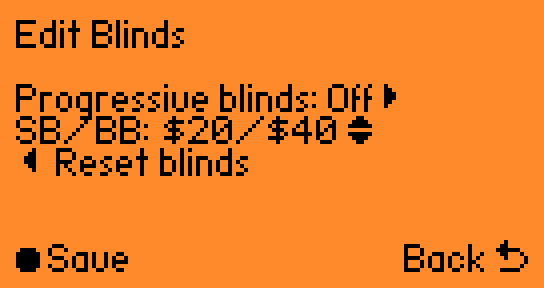
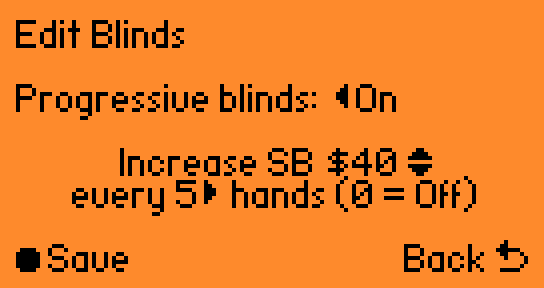
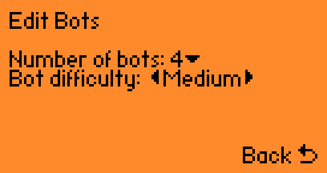
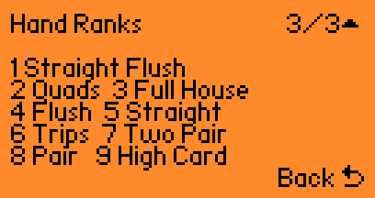
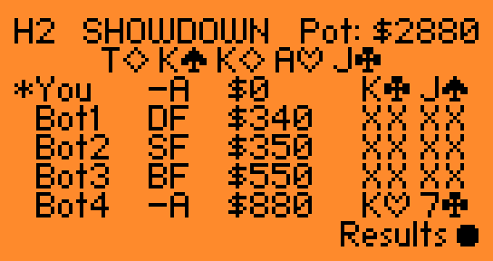
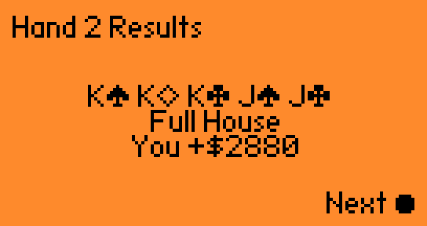

# Hold 'em for Flipper Zero

Native single-player Texas Hold'em built specifically for Flipper Zero.

Play a full table of compact, readable Hold 'em against up to four bots with real betting rounds, side-pot-aware showdowns, save/load, and a UI tuned for the actual device screen.

## Screenshots

On-device flow at a glance:

<table>
  <tr>
    <td align="center" width="50%"><strong>Startup</strong></td>
    <td align="center" width="50%"><strong>Main Table</strong></td>
  </tr>
  <tr>
    <td align="center" width="50%"></td>
    <td align="center" width="50%"></td>
  </tr>
  <tr>
    <td align="center" width="50%"><strong>Controls</strong></td>
    <td align="center" width="50%"><strong>Game Menu</strong></td>
  </tr>
  <tr>
    <td align="center" width="50%"></td>
    <td align="center" width="50%"></td>
  </tr>
  <tr>
    <td align="center" width="50%"><strong>Edit Blinds (1)</strong></td>
    <td align="center" width="50%"><strong>Edit Blinds (2)</strong></td>
  </tr>
  <tr>
    <td align="center" width="50%"></td>
    <td align="center" width="50%"></td>
  </tr>
  <tr>
    <td align="center" width="50%"><strong>Edit Bots</strong></td>
    <td align="center" width="50%"><strong>Hand Ranks</strong></td>
  </tr>
  <tr>
    <td align="center" width="50%"></td>
    <td align="center" width="50%"></td>
  </tr>
  <tr>
    <td align="center" width="50%"><strong>Big Win</strong></td>
    <td align="center" width="50%"><strong>Showdown</strong></td>
  </tr>
  <tr>
    <td align="center" width="50%"></td>
    <td align="center" width="50%"></td>
  </tr>
  <tr>
    <td align="center" width="50%"><strong>Hand Result</strong></td>
    <td align="center" width="50%"><strong>Game Win</strong></td>
  </tr>
  <tr>
    <td align="center" width="50%"></td>
    <td align="center" width="50%"></td>
  </tr>
</table>

## Features

- Full on-device Texas Hold'em from preflop through showdown
- Heads-up play or full five-player tables with up to four bots
- Side-pot-aware payouts and split-pot handling for real multi-way hands
- Four bot difficulty levels: Easy, Medium, Hard, and Extreme
- Blind editor with optional progressive blinds
- Save/load for full game state and table settings
- Compact screen-first interface with bitmap suit and control glyphs
- Clear showdown, result, and interstitial screens built for real hardware
- In-game controls help, bot editor, and confirmation-backed new-game flow
- Fast, readable pacing that keeps every betting round easy to follow

## Build

```bash
ufbt update
ufbt
```

Build output:
- `dist/holdem.fap`

## Install

1. Connect Flipper Zero over USB.
2. Build locally with `ufbt update` and `ufbt`.
3. Copy `dist/holdem.fap` to `/ext/apps/Games/`.
4. Launch from `Apps -> Games -> Hold 'em`.

## Changelog

- [docs/changelog.md](docs/changelog.md)

## Controls

### In Hand
- `Left`: Fold
- `OK`: Commit the current action (`Check`, `Call`, or `Raise`)
- `Up/Down`: Increase or decrease the current bet amount
- `Right`: Reset the current bet amount to the default call/check value
- `Hold Right`: Set the current bet to all in
- After folding, `OK` can fast-forward through the remaining autoplayed bot action

### Global
- `Back` short:
  - From the game screen: open Controls Help
  - From menu screens: close or cancel the current menu
- `Back` hold: open `Exit Hold 'em`

### Exit Menu
- `OK`: Save and exit
- `Back` short: Cancel
- `Back` hold: Exit without saving

## Save Behavior

Save path:
- `/ext/apps_data/holdem/save.bin`

Startup behavior when a save exists:
- `OK`: Load save
- `Back`: Start a new game without loading the previous save

There is only one save slot by design.
A fresh unsaved game does not delete the existing save until a later save overwrites it.
Gameplay settings such as bot difficulty, fixed blind configuration, and progressive blinds are included in the saved state.
Saved progressive-blind timing state is also preserved so future increases still trigger on the correct hand after load.
If progressive blinds are active, the underlying base `SB/BB` used for future fresh games is saved separately from the current in-hand blind level.

## Fairness and RNG

Card dealing fairness is based on:
- Hardware RNG via `furi_hal_random_fill_buf`
- Fisher-Yates shuffle across all 52 cards before each hand

Current bounded random selection uses modulo reduction (`value % upper_bound`).

What this guarantees:
- No duplicate cards in a hand
- A full-deck shuffle every hand
- No AI influence over card distribution

What remains open for future improvement:
- Replace modulo reduction with rejection sampling to eliminate modulo bias entirely

## AI

Bot difficulty is exposed as `Easy`, `Medium`, `Hard`, and `Extreme`, with `Medium` as the default table setting.

At the top end, `Extreme` goes beyond the baseline heuristic bot by:
- reacting more carefully to real betting pressure
- valuing strong broadway and connector structures more accurately preflop
- factoring in draw development postflop instead of playing only made hands
- tightening bluff frequency while pushing harder for value with credible strength
- avoiding weak stack-off lines more aggressively when pots get large

## Firmware Notes

Target/API:
- Target 7
- API 87.1

The app is intended for official firmware and compatible forks, including Momentum, as long as they preserve external-app API compatibility.

## Repository Layout

- `holdem.c`: top-level app bootstrap, lifecycle, and main loop orchestration
- `holdem_engine.c/.h`: gameplay flow, pot handling, and showdown logic
- `holdem_ai.c/.h`: bot decision logic
- `holdem_eval.c/.h`: hand evaluation and card formatting helpers
- `holdem_storage.c/.h`: save/load management
- `holdem_app_internal.h`: shared internal interfaces for the split UI/controller modules
- `holdem_ui_common.c`: shared glyphs, centering helpers, and app-state display helpers
- `holdem_ui_render.c`: all screen rendering and table-layout code
- `holdem_ui_flow.c`: menu/input flow, edit-state commits, startup, and back-button handling
- `holdem_gameplay.c`: result/interstitial flow and betting-round plus hand orchestration
- `holdem_types.h`: shared types and constants
- `application.fam`: app metadata
- `holdem.png`: app icon
- `docs/architecture.md`: architecture and extension notes
- `docs/roadmap.md`: release follow-up and deferred work
- `docs/changelog.md`: release history and pending changes
- `docs/pre-release-tests.md`: high-risk validation checklist for payout, showdown, and rules edge cases
- `docs/screenshots/`: padded screenshots for GitHub README presentation
- `.catalog/`: Flipper catalog submission description, changelog, and raw screenshot assets
- `CONTRIBUTING.md`: contributor workflow

## Acknowledgements

- The compact bitmap suit presentation was inspired by [flipper_blackjack](https://github.com/doofy-dev/flipper_blackjack).

## Contributing

Contributions are welcome.

For the smoothest review path and the fewest merge conflicts, contribute from the most recent active feature branch rather than `main`.

Please read:
- `CONTRIBUTING.md`

## License

MIT
